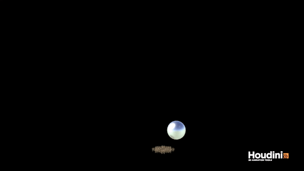
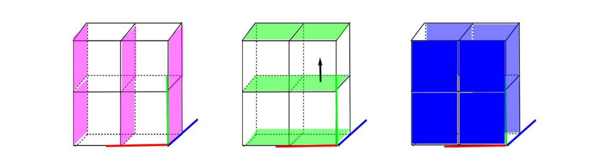
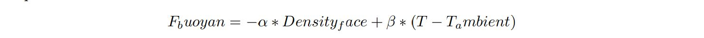
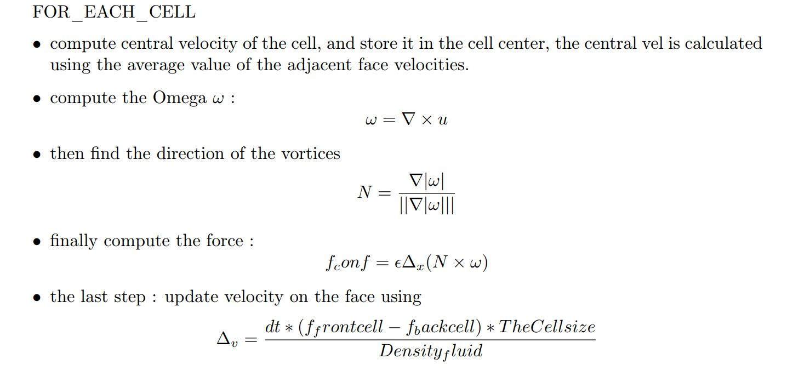
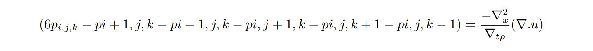

# smoke simulation # 

## Highlight renders

*Single smoke scene:*

   


*Inter-smoke collision scene:*

 


*smoke rigid-body collision scene:*




## Introduction:

This project is based on the paper [*Visual simulation of smoke*](https://web.stanford.edu/class/cs237d/smoke.pdf)
and the [*2007 SIGGRAPH fluid course notes*](https://www.cs.ubc.ca/~rbridson/fluidsimulation/fluids_notes.pdf) and also some of Aline Normoyle ’s fluid simulation tutorial.

The fundamental
data structure across this project is something called staggered MAC Grid (Marker-and-Cell Method) view,in this view,
instead of treating the simulated targets as Lagrangian particles, we evaluate all the physics based
on a constant Eulerian grid which is mac grid.

The code of this project is written in C++, the system I’m using is ubuntu virtual machine running with 6 Gigabytes memory and 6 Core virtual
processor of intel i7-6700HQ.

In general, the entire simulation process can be divided into a few steps as follows:
- generate resource particles with initial velocities, temperature, density.
- advection of velocity, using semi-Lagrangian advection and RK2.
- compute two external forces: vorticity confinement force, the buoyancy force and use force
update velocities.
- apply projection to keep the divergence free and use the pressure result update the velocities
again.
- advection of temperature , density also using semi-Lagrangian advection and RK2.

Now I will explain each step in detail

## Simulation process:

### The MAC-Grid:

First let's get into detail about the mac grid data structure.

The data that is going to be stored are : 
- velocities on three faces in each cell, 
- temperature stored in the center of each cell
- density stored in the center of each cell
- pressure stored in the center of each cell. 

As shown in the figure below, this is a ```2X2X1``` grid
example, there are three faces in x and y direction but only two faces in ```Z``` direction



, similarly,
when we are storing ```X × Y × Z``` cells, the velocities in ```X``` directions can be traversed using the
```(X + 1) × Y × Z``` , so different from the ```FOR_EACH_FACE``` provided by the theory in the course note, I choosed to used
```FOR_EACH_FACE_X```, ```FOR_EACH_FACE_Y```, and ```FOR_EACH_FACE_Z``` to do iterations
for data in faces of each directions respectively, as for the pressure, density, temperature, they are
simply stored in the cell center, can be traversed using ```FOR_EACH_CELL```.

### Advection:

Since the advection of velocity, density and temperature are similar, I will just put the explanation
together:
In short, the pseudo code of advection can be written as this:

``` 
FOR_EACH_FACE {
         currentpt = position at center of current face ;
         currentvel = velocity at center of current face ;
         midpt = currentpt - dt * currentvel / 2.0 ;
         midvel = interpolate velocity at mipt ;
         oldpt = currentpt - dt * midvel ;
         newvel = interpolate velocity at old location ;
         store one component of newvel depending on face type ; }
         
```

Similarly , if you want to advect density temp etc which are stored in cell, center, you only
need to change FOR_EACH_FACE into FOR_EACH_CELL and change the interpolation to
the corresponding type, also ,one thing to mention is that the interpolation of this project is using
a cubic interpolation using the surrounding 4 cells or faces.

### The buoyancy force:
Like many other physics simulation, smoke simulation also have to take the gravity and temperature
etc into consideration, this leads us to the derivation of the buoyancy force for smoke, one governing
equation for this behavior is



where α and β are user defined parameters, Density face indicates the average density on the
current face that you are computing the velocity on, T ambient is set to 0 by default.

### The vorticity confinement force

One feature that distinguish smoke’s behavior from simple particle material is the vorticity confinement,
also , I will write a short description for this part :



### Projection:

The main purpose of the projection step is to make sure the fluid maintain divergence free :


and in the meantime follow the possion equation :


then we get :



finally we will be able to represent these in the form of a matrix multiplication : Ap = b in the
left hand side, A is a matrix following these orders :

- each element in A indicate a cell
- Pi,j,k indicate the current cell, and the others are the one surrounding it
- the coefficient for pi,j,k is the number of the neighbors, and for the others the coefficients is -1
- non neighbors have coefficients equal 0

now that we have constructed A we have to construct vector b , basically vector b is simply
the divergence of the eulerian grid, the sum of it have to be strictly zero since we are obeying
divergence free.

To be more specific, I will display a pseudo code of this :

```
gridData divergence;

FOR_EACH_CELL {
divergence(i,j,k) = −(mU(i+1, j, k)−mU(i, j, k)+mV (i, j+1, k)−mV (i, j, k)+mW(i, j, k+ 1) − mW(i, j, k))/T HEcellsize;
}

```

Now , I have A and b, I can finally compute p, I used the PCG provided by the base code to
iteratively solve the linear equations, I add the calculate preconditioner code based on the fluid course[2] page 36 ,figure 4.2.
Then, we use the gradient of P to update velocities.

## Reference:
- [Visual simulation of smoke](https://web.stanford.edu/class/cs237d/smoke.pdf)
- [2007 SIGGRAPH fluid course notes](https://www.cs.ubc.ca/~rbridson/fluidsimulation/fluids_notes.pdf)
